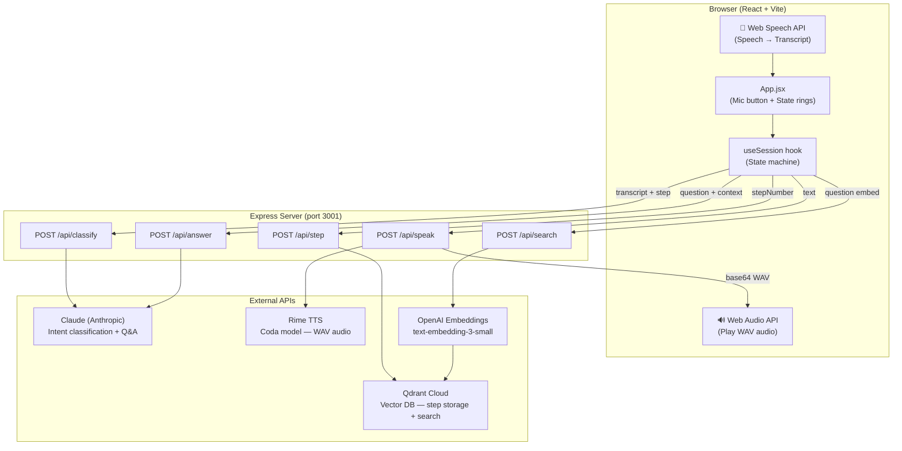
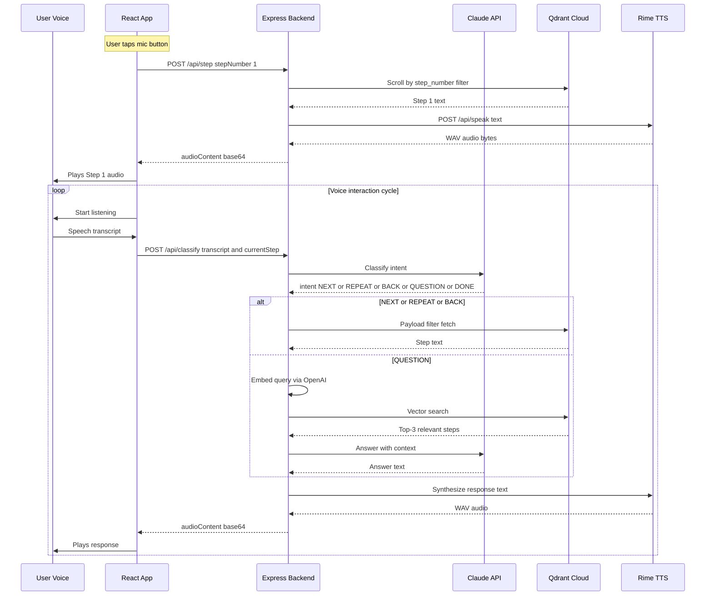

# 🎙️ Hands-Free Assistant

> A voice-controlled, eyes-free step-by-step guide for hands-busy tasks — cooking, lab work, assembly. No screen interaction required once the session starts.

---

## Architecture



### Core Voice Loop



---

## Setup

### Prerequisites

- Node.js 18+ (or use [fnm](https://github.com/Schniz/fnm))
- Accounts and API keys for: [Rime AI](https://rime.ai), [Qdrant Cloud](https://cloud.qdrant.io), [Anthropic](https://console.anthropic.com), [OpenAI](https://platform.openai.com)

### 1. Clone and install dependencies

```bash
git clone <your-repo>
cd voiceAI
npm install
```

### 2. Configure environment variables

```bash
cp .env.example .env
# Edit .env and fill in all 5 API keys
```

### 3. Create Qdrant collection and embed procedure steps

```bash
npm run setup
```

This will:
- Create a `hands-free-procedures` collection in Qdrant with 1536-dim cosine vectors
- Embed all 8 Cold Brew Coffee steps using OpenAI `text-embedding-3-small`
- Upsert all points into Qdrant

Run this only once. It is safe to re-run as it updates existing points.

### 4. Start the app

```bash
npm run dev
```

This concurrently starts:
- Express backend on **http://localhost:3001**
- Vite dev server on **http://localhost:5173**

Open **http://localhost:5173** in **Chrome or Edge** (Web Speech API required).

---

## Usage

1. Open the app in Chrome or Edge
2. Allow microphone access when prompted
3. **Tap the mic button** to start — the assistant speaks Step 1
4. The assistant automatically starts listening after speaking
5. Say a command:

| Voice command | What happens |
|---|---|
| "next", "continue", "okay" | Advances to the next step |
| "repeat", "say that again" | Repeats current step |
| "go back", "previous" | Goes back one step |
| "go back two steps" | Goes back two steps |
| "how much coffee?", "how long?" | Semantic search in Qdrant, Claude answers |
| "done", "I'm finished", "stop" | Ends the session |

The app is audio-only — no text is displayed on screen during a session. This is intentional.

---

## Environment Variables

| Variable | Required | Service | Purpose |
|---|---|---|---|
| `RIME_API_KEY` | Yes | Rime AI | Text-to-speech synthesis |
| `QDRANT_URL` | Yes | Qdrant Cloud | Vector database cluster URL |
| `QDRANT_API_KEY` | Yes | Qdrant Cloud | Database authentication |
| `QDRANT_COLLECTION` | Yes | Qdrant Cloud | Collection name (default: hands-free-procedures) |
| `ANTHROPIC_API_KEY` | Yes | Anthropic | Intent classification and Q&A answers |
| `OPENAI_API_KEY` | Yes | OpenAI | Text embeddings for setup and semantic search |
| `PORT` | No | Express | Backend port (default: 3001) |

---

## Project Structure

```
voiceAI/
├── server/
│   ├── index.js              # Express entry point
│   ├── routes/
│   │   ├── classify.js       # POST /api/classify — Claude intent classification
│   │   ├── step.js           # POST /api/step — Qdrant payload filter fetch
│   │   ├── search.js         # POST /api/search — semantic vector search
│   │   ├── speak.js          # POST /api/speak — Rime TTS proxy
│   │   └── answer.js         # POST /api/answer — Claude Q&A with context
│   ├── lib/
│   │   ├── qdrant.js         # Qdrant REST client
│   │   ├── claude.js         # Claude API client
│   │   ├── rime.js           # Rime TTS client
│   │   └── embeddings.js     # OpenAI embeddings client
│   └── data/
│       └── procedures.json   # Cold Brew Coffee — 8 steps
├── scripts/
│   └── setup-qdrant.js       # One-time embed and upsert script
├── src/
│   ├── App.jsx               # Main React component (mic button + state rings)
│   ├── App.css               # Premium dark-mode styles with state animations
│   ├── hooks/
│   │   ├── useSpeechRecognition.js  # Web Speech API wrapper hook
│   │   └── useSession.js           # Session state machine hook
│   └── main.jsx              # Vite entry
├── .env.example              # Env var template
├── vite.config.js            # Vite config with /api proxy
└── package.json
```

---

## Known Limitations

1. **Browser compatibility**: Web Speech API works only in Chrome and Edge — not Firefox or Safari
2. **No offline support**: Requires internet for all 4 external APIs
3. **Single procedure**: Only Cold Brew Coffee is hardcoded. Add more to `procedures.json` and re-run `npm run setup`
4. **No session persistence**: Step index lives in React state — refreshing resets to step 1
5. **Noisy environments**: Web Speech API degrades with background noise; handled gracefully with fallback phrase
6. **Rime free tier**: 3,000 free minutes on Starter plan — ample for demos
7. **OpenAI cost**: Minimal — under $0.001 for 8-step setup, $0.0001 per search query

---

## How Qdrant is Used Beyond Simple RAG

This app uses Qdrant in two distinct ways:

**1. Payload-filtered fetch** (NEXT / REPEAT / BACK): Retrieves exact steps by `step_number` and `procedure_id` without vector similarity — pure structured lookup with the Scroll API.

**2. Semantic vector search** (QUESTION intent): When the user asks something like "how long does it need to steep?", the question is embedded and matched against all step vectors. Top results become context for Claude's grounded answer.

The state-tracking plus intent classification means the system never forgets where the user is, and can jump multiple steps forward or back based on natural speech — this is the meaningful differentiator from basic RAG.
